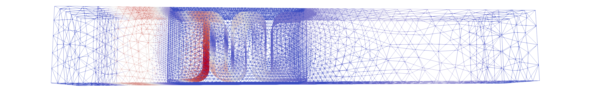
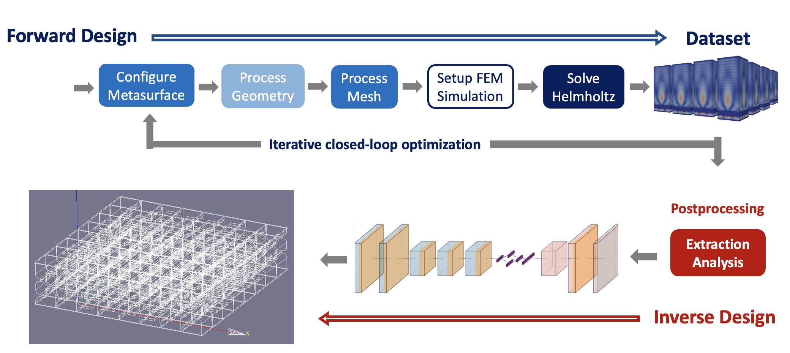
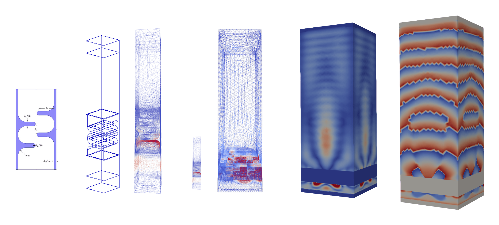

# genam — Generative Acoustic Metamaterial

[](LICENSE)

`genam` is a Python framework for the generative design, modelling, meshing, simulation, and optimisation of acoustic metamaterials.

It automates a workflow for building labyrinthine acoustic metasurfaces, generating finite-element meshes, preparing Elmer solver inputs, running acoustic wave-scattering simulations, and extracting simulation data for analysis or optimisation.



## Overview

`genam` implements an end-to-end pipeline for acoustic metamaterial research:

1. Define a metasurface lens as a matrix of quantized unit-cell identifiers.
2. Generate parametric 3D geometry in Salome.
3. Mesh the model with Salome SMESH.
4. Export the mesh to `.unv`.
5. Convert the mesh to Elmer format.
6. Copy solver templates and `.sif` files.
7. Run ElmerSolver.
8. Analyse simulation outputs from `.vtu` files.



The framework is intended for research workflows involving acoustic metasurfaces, wave scattering, synthetic data generation, and optimisation of labyrinthine unit-cell arrangements.

## Features

- Parametric modelling of labyrinthine acoustic bricks.
- Support for metasurface lenses defined by quantized unit-cell matrices.
- Salome-based geometry and meshing automation.
- ElmerFEM solver integration.
- Batch-mode execution for server and HPC workflows.
- Analysis utilities for pressure, phase, and optimisation targets.
- Example scripts for multiple lens configurations, including `1x1`, `2x2`, `4x4`, `8x1`, `16x1`, `16x2`, `16x6`, and larger quantized matrices.

## Workflow

```text
quantized lens matrix
        │
        ▼
lens configuration
        │
        ▼
Salome geometry generation
        │
        ▼
Salome mesh generation
        │
        ▼
.unv mesh export
        │
        ▼
Elmer mesh conversion
        │
        ▼
ElmerSolver simulation
        │
        ▼
.vtu output analysis
```

## System requirements

`genam` is designed to run inside Salome's Python environment, not a standard system Python environment.

Required external software:

- [Salome 9.8.0](https://salome-platform.org/) — geometry, meshing, and simulation platform.
- [ElmerFEM](https://www.csc.fi/web/elmer) — finite-element multiphysics solver.
- [ParaView](https://www.paraview.org/) — visualisation and post-processing of simulation outputs.

Supported platforms:

- Windows
- Linux
- HPC clusters or high-performance workstations

> [!IMPORTANT]
> Most `genam` scripts must be executed with Salome's Python interpreter because they depend on Salome GEOM and SMESH modules.

## Python dependencies

Additional Python packages used for post-processing, data handling, machine learning, and analysis include:

```text
matplotlib
pandas
meshio
torch
torchvision
tqdm
six
lmdb
```

These packages should be installed into Salome's Python environment.

## Installation

Clone the repository:

```bash
git clone https://github.com/frantic0/genam.git
cd genam
```

Install the package in editable mode:

```bash
python -m pip install -e .
```

For standard Python environments, this installs the `genam` package. For Salome-based workflows, use Salome's bundled Python interpreter instead of your system Python interpreter.

### Installing dependencies in Salome on Windows

If Salome is installed at:

```text
C:\SALOME-9.8.0
```

install Python dependencies with Salome's Python interpreter:

```powershell
C:\SALOME-9.8.0\W64\Python\python.exe -m pip install -r requirements.txt
```

Or install individual packages:

```powershell
C:\SALOME-9.8.0\W64\Python\python.exe -m pip install pandas meshio matplotlib
```

### Installing dependencies in Salome on Linux

After unpacking Salome, initialise the Salome environment:

```bash
source /path/to/SALOME-9.8.0/env_launch.sh
```

Then install dependencies using the Python interpreter available in that environment:

```bash
python -m pip install -r requirements.txt
```

## Running with Salome

Start Salome from the command line:

```bash
python salome
```

Run Salome in batch mode, without the graphical user interface:

```bash
python salome -t -w1
```

Run a `genam` generation or test script in batch mode:

```bash
python salome -t -w1 tests/test_quantized_matrix_1_1.py args:15
```

This generates geometry and mesh data for the selected labyrinthine brick, exports mesh files, prepares Elmer input files, and runs the solver workflow.

> [!NOTE]
> Depending on your installation, the Salome launcher may be named `salome`, `salome.bat`, or located inside the Salome installation directory.

## Usage

A typical `genam` script runs inside Salome, initialises the Salome environment, defines a lens configuration, generates geometry, meshes the model, exports it, runs Elmer, and analyses the result.

### 1. Initialise Salome

```python
import sys
from pathlib import Path

import salome

salome.salome_init()
```

If Salome changes the working directory, add the project paths manually:

```python
sys.path.insert(0, r"C:/Users/user/Documents/dev/genam")
sys.path.insert(0, r"C:/Users/user/Documents/dev/genam/tests")
```

### 2. Import `genam`

```python
import numpy as np

from genam.lens import Lens
from genam.configuration.lens import configurator as lens_configurator
from genam.configuration.mesh import configurator as mesh_configurator
from genam.solver import (
    convert_mesh,
    copy_solver_templates,
    copy_sif,
    run_elmer_solver,
)
from genam.analysis import Analysis
```

### 3. Define a quantized metasurface lens

A lens is represented as a matrix of quantized unit-cell identifiers. Each value refers to one labyrinthine brick configuration.

```python
quantized_matrix_8_8 = np.array([
    [ 4,  7, 10, 13, 13, 10,  7,  4],
    [ 5,  9, 13,  3,  3, 13,  9,  5],
    [10, 13,  0,  6,  6,  0, 13, 10],
    [15,  3,  6,  7,  7,  6,  3, 15],
    [15,  3,  6,  7,  7,  6,  3, 15],
    [10, 13,  0,  6,  6,  0, 13, 10],
    [ 5,  9, 13,  3,  3, 13,  9,  5],
    [ 4,  7, 10, 13, 13, 10,  7,  4],
])
```

### 4. Build and mesh the lens

```python
lens_name = "quantized_matrix_8_8"

lens_config = lens_configurator(quantized_matrix_8_8)
mesh_config = mesh_configurator(3)

lens = Lens(
    lens_config,
    mesh_config,
    name=lens_name,
)

lens.process_geometry()
lens.process_mesh()
```

### 5. Export and convert the mesh

```python
DATASET_PATH = Path("/path/to/dataset")

UNV_PATH = DATASET_PATH / f"{lens_name}.unv"

lens.export_mesh(str(UNV_PATH))

# Convert the Salome .unv mesh to Elmer mesh format.
convert_mesh(UNV_PATH)
```

### 6. Prepare and run ElmerSolver

```python
SOLVER_DATA_PATH = DATASET_PATH / lens_name
SIF_PATH = Path("tests/sif/test_quantised_matrix.sif")

copy_solver_templates(SOLVER_DATA_PATH)
copy_sif(SOLVER_DATA_PATH, SIF_PATH)

run_elmer_solver(SOLVER_DATA_PATH)
```

### 7. Analyse solver output

```python
vtu_file = SOLVER_DATA_PATH / "case-40000_t0001.vtu"

analysis = Analysis(str(vtu_file))

optimisation_targets = sorted([
    point
    for point in analysis.points
    if point[2] == 0.1 and point[0] < 0 and point[1] < 0
])

optimisation_target = optimisation_targets[-1]
optimisation_target_id = analysis.points.index(optimisation_target)

optimisation_target_pressure = analysis._absolute_pressure.GetValue(
    optimisation_target_id
)

print("Target point:", optimisation_target)
print("Pressure:", optimisation_target_pressure)
```

## Parametric modelling, meshing, and simulation



`genam` supports parametric generation of 3D labyrinthine acoustic unit cells with configurable design and simulation parameters, including:

- Wavelength
- Aggregate flap size
- Aggregate flap distance
- Perfectly matched layer offset
- Mesh size
- Mesh element order

These parameters can be used to generate different acoustic brick geometries and metasurface lens layouts.

## Example: 16×16 focusing metasurface

`genam` can also define larger metasurface lens layouts as quantized matrices. The following example defines a `16x16` focusing metasurface lens.

<details>
<summary>Show 16×16 quantized matrix example</summary>

```python
import numpy as np

quantized_matrix_16_16 = np.array([
    [13,  0,  3,  5,  7,  8,  9, 10, 10,  9,  8,  7,  5,  3,  0, 13],
    [ 0,  3,  6,  8, 10, 12, 13, 13, 13, 13, 12, 10,  8,  6,  3,  0],
    [ 3,  6,  9, 11, 13, 15,  0,  0,  0,  0, 15, 13, 11,  9,  6,  3],
    [ 5,  8, 11, 14,  0,  1,  2,  3,  3,  2,  1,  0, 14, 11,  8,  5],
    [ 7, 10, 13,  0,  2,  3,  4,  5,  5,  4,  3,  2,  0, 13, 10,  7],
    [ 8, 12, 15,  1,  3,  5,  6,  6,  6,  6,  5,  3,  1, 15, 12,  8],
    [ 9, 13,  1,  4,  5,  6,  7,  7,  7,  7,  6,  5,  4,  1, 13,  9],
    [10, 13,  0,  3,  5,  6,  7,  8,  8,  7,  6,  5,  3,  0, 13, 10],
    [10, 13,  0,  3,  5,  6,  7,  8,  8,  7,  6,  5,  3,  0, 13, 10],
    [ 9, 13,  1,  4,  5,  6,  7,  7,  7,  7,  6,  5,  4,  1, 13,  9],
    [ 8, 12, 15,  1,  3,  5,  6,  6,  6,  6,  5,  3,  1, 15, 12,  8],
    [ 7, 10, 13,  0,  2,  3,  4,  5,  5,  4,  3,  2,  0, 13, 10,  7],
    [ 5,  8, 11, 14,  0,  1,  2,  3,  3,  2,  1,  0, 14, 11,  8,  5],
    [ 3,  6,  9, 11, 13, 15,  0,  0,  0,  0, 15, 13, 11,  9,  6,  3],
    [ 0,  3,  6,  8, 10, 12, 13, 13, 13, 13, 12, 10,  8,  6,  3,  0],
    [13,  0,  3,  5,  7,  8,  9, 10, 10,  9,  8,  7,  5,  3,  0, 13],
])
```

</details>

## Repository structure

```text
genam/
├── analysis/          # Analysis utilities for simulation outputs
├── configuration/     # Lens and mesh configuration helpers
├── design/            # Design-related components
├── optimisation/      # Optimisation workflows
├── solver/            # Solver integration utilities
├── lens.py            # Main lens geometry and meshing class
├── lens_hemisphere.py
└── lens_hemisphere_PML.py

solver/                # Solver templates and related files
tests/                 # Example scripts and test workflows
docs/img/              # README and documentation images
requirements.txt       # Python dependencies
setup.py               # Python package setup
pyproject.toml         # Build-system metadata
```

## Example workflows

The `tests/` directory contains example scripts for generating and simulating different lens configurations, including:

- Single-brick studies.
- Small metasurface arrangements.
- Quantized matrix lenses.
- Parallel matrix generation workflows.
- Closed-loop optimisation experiments.
- Simulated annealing experiments.
- Pressure-map generation examples.
- Inlet element export examples.

Useful starting points include:

```text
tests/test_quantized_matrix_1_1.py
tests/test_quantized_matrix_2_2.py
tests/test_quantized_matrix_4_4.py
tests/test_quantized_matrix_8_8.py
tests/test_quantized_matrix_16_16.py
tests/test_parallel_quantized_matrix_8_8.py
tests/test_closed_loop_optimisation.py
tests/test_closed_loop_simulated_annealing.py
```

## Working with Salome and IDEs

Because `genam` depends on Salome modules, standard IDEs may not resolve imports such as `salome`, `GEOM`, or `SMESH` unless they are configured to use Salome's Python environment.

For guidance, see:

- [Using Python Salome libraries from a Python IDE](https://discourse.salome-platform.org/t/using-python-salome-libraries-from-a-python-ide/63/7)

## Notes and limitations

- `genam` is currently tied to Salome 9.8.0 workflows.
- Scripts are usually executed through Salome, not through a standard Python interpreter.
- ElmerFEM must be installed and available to run solver workflows.
- Batch mode is recommended for larger studies or HPC execution.
- Large generated datasets, meshes, and solver outputs should be stored outside the repository.
- Paths in example scripts should be adapted to your local workstation, server, or cluster environment.

## License

`genam` is licensed under the MIT License. See [LICENSE](LICENSE) for details.
